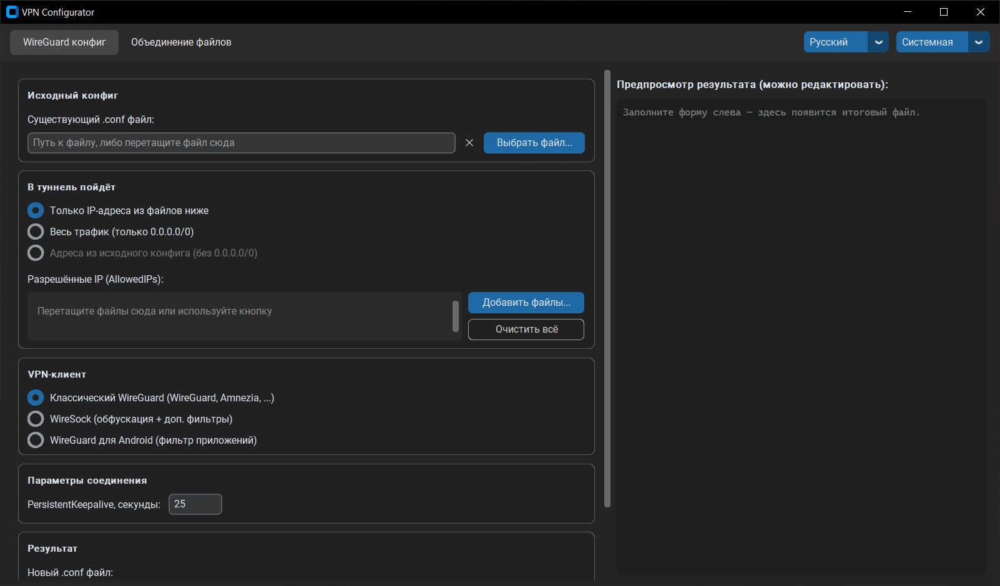

# VPN Configurator

> [🇬🇧 English version — README_EN.md](README_EN.md)

> [!IMPORTANT]
> Данный материал подготовлен в научно-технических целях. Использование предоставленных материалов в целях отличных от ознакомления может являться нарушением действующего законодательства.
> Автор не несет ответственности за неправомерное использование данного материала!

**VPN Configurator** — программа с графическим интерфейсом для создания конфигураций VPN-клиентов с **раздельным туннелированием** трафика и объединения файлов с IP-адресами. Язык интерфейса — русский или английский, определяется автоматически и переключается вручную.

**Раздельное туннелирование** — это режим работы VPN, при котором через VPN проходит только трафик к указанным сайтам или сервисам, а весь остальной интернет работает как обычно, без потери скорости.


> [!TIP]
> **Здесь только клиентская часть. Серверная — [vpn-infra](https://github.com/Friskes/vpn-infra).**
> Разворачивает личный VPN на чистом VPS одной командой: WireGuard, VLESS + Reality,
> два DNS-туннеля и RustDesk, каждый сервис отдельным выключателем. Оттуда и берётся
> тот `.conf`, из которого эта программа делает конфиг с раздельным туннелированием.

---

## Возможности

**1. WireGuard конфиг (Amnezia / WireSock / WireGuard)**
На основе существующего `.conf`-файла создаёт новый конфиг с IP-адресами для раздельного туннелирования:

- только указанные IP-адреса — из файлов с адресами;
- либо весь трафик (`0.0.0.0/0`);
- либо адреса из исходного конфига с отброшенным `0.0.0.0/0` — удобно, когда выданный конфиг перечисляет нужные подсети, но заканчивается catch-all хвостом и оттого тянет весь трафик;
- **Классический WireGuard** (WireGuard, Amnezia и совместимые) — конфиг без нестандартных ключей;
- **WireSock** — плюс обфускация (маскировка WireGuard-трафика от DPI) и дополнительные фильтры: исключение IP-адресов из туннеля (`DisallowedIPs`) и чёрный или белый список приложений (`DisallowedApps` / `AllowedApps`). В список приложений можно перетащить исполняемый файл любой ОС (`.exe`, бинарь macOS/Linux, `.app`) — именем приложения станет имя файла — либо текстовый файл со списком имён;
- **WireGuard для Android** — чёрный или белый список приложений по именам Android-пакетов (`ExcludedApplications` / `IncludedApplications`). Эти два ключа понимает только WireGuard для Android и его форки (AmneziaWG, WG Tunnel) — десктопные клиенты откажутся грузить такой конфиг с ошибкой `Invalid key`, поэтому режим вынесен отдельным пунктом.

**Совместная работа двух VPN.** Если параллельно работает второй туннель (например, корпоративный), укажите его `.conf` — адрес его сервера и его конкретные подсети будут вычтены из `AllowedIPs` генерируемого конфига. Без этого пакеты второго VPN заворачиваются внутрь первого (двойная обёртка не влезает в MTU — сайты «то открываются, то нет»), а его подсети перехватываются. Исключения LAN-диапазонов и ручные списки исключений могут вырезаться прямо из `AllowedIPs` — такой конфиг понимает любой клиент, включая Amnezia, у которой ключа `DisallowedIPs` нет.

В режиме **«туннелировать весь трафик»** адрес VPN-сервера из `Endpoint` исключается из туннеля автоматически. Смысл: сервисы, поднятые на том же сервере (панель, свой RustDesk, прокси), остаются доступны напрямую и не ходят к нему крюком через туннель. У WireSock адрес просто дописывается в `DisallowedIPs`; у Android такого ключа нет, поэтому `0.0.0.0/0` заменяется на список диапазонов без адреса сервера. Доменное имя в `Endpoint` не резолвится — адрес сервера может смениться, и записанный в конфиг результат разовой резолвации станет неверным.

Для любого клиента доступно поле **`PersistentKeepalive`** (в секундах) — оно держит NAT-трансляцию живой, чтобы сервер мог достучаться до клиента. Поле заполняется значением из исходного конфига, а если ключа там нет или он равен `0` — рекомендованными WireGuard `25`. Значение можно изменить перед генерацией, а пустое поле оставит ключ ровно таким, каким он был в исходнике.

**2. Объединение / конвертация файлов с IP-адресами**
Объединяет несколько файлов в один без дубликатов и некорректных адресов. Входные файлы — в любом сочетании, формат определяется автоматически, расширение не важно:

- адреса в любом текстовом виде — построчно, через запятую, пробел или точку с запятой;
- команды Windows `route ADD <ip> MASK <маска> <шлюз>`;
- Amnezia `.json`.

Формат результата на выбор: plaintext `.txt`, Amnezia `.json` или команды Windows `route` (`.bat`). Один файл на входе + другой формат на выходе = конвертация.

В GUI файлы можно перетаскивать мышью (drag & drop) прямо в окно программы, убирать по одному кнопкой напротив каждого, а результат показывается в редактируемом предпросмотре с подсветкой синтаксиса — текст можно поправить руками перед сохранением.



---

### Готовые наборы IP-адресов в папке `AllowedIPs/`

| Файл | Сервис |
|---|---|
| `youtube.txt` | YouTube |
| `chatgpt.txt` | ChatGPT / OpenAI |
| `discord.txt` | Discord |
| `ghcopilot.txt` | GitHub Copilot |
| `instagram.txt` | Instagram |
| `jetbrains.txt` | JetBrains |
| `telegram.txt` | Telegram |
| `whatsapp.txt` | WhatsApp |
| `pypi.txt` | PyPI / pip / uv / uvx (Python пакеты) |
| `twitch.txt` | Twitch (1080p + Unblock GeoIP) |
| `meta.txt` | Meta (Facebook / Instagram / WhatsApp) |
| `anthropic.txt` | Anthropic / Claude Code |
| `rutracker.txt` | RuTracker |
| `all.txt` | Все сервисы из списка выше объединены в один файл |

Дополнительные наборы — в разделе [Где взять IP-адреса](#где-взять-ip-адреса).

### Готовые списки приложений

| Папка | Назначение |
|---|---|
| `DisallowedApps/` | Имена приложений для фильтра WireSock (`DisallowedApps` / `AllowedApps`) |
| `ExcludedApplications/` | Имена Android-пакетов для WireGuard для Android (`ExcludedApplications` / `IncludedApplications`) |

В обеих папках `all.txt` — общий список; сейчас в нём RustDesk.

---

## Как запустить

### Windows (.exe)

1. Скачайте `.exe` со страницы релизов: **[⬇ GitHub Releases](https://github.com/Friskes/vpn-configurator/releases/latest)**
2. Запустите **двойным кликом** — откроется графический интерфейс.

### macOS

1. Скачайте архив для вашей архитектуры со страницы релизов: **[⬇ GitHub Releases](https://github.com/Friskes/vpn-configurator/releases/latest)**

   | Процессор | Файл |
   |---|---|
   | Apple M1/M2/M3/M4 | `vpn_configurator_vX.X.X.macos-arm64.zip` |
   | Intel | `vpn_configurator_vX.X.X.macos-x86_64.zip` |

   > Не знаете какой процессор? Нажмите  → «Об этом Mac» — в строке «Чип» или «Процессор» будет указано.
2. Распакуйте архив — внутри будет `vpn_configurator.app`. Запустите его **двойным кликом** (откроется графический интерфейс, без окна терминала).

   > Приложение не подписано, поэтому при первом запуске macOS может его заблокировать. Снимите карантин командой в **Терминале** (один раз):
   >
   > ```bash
   > xattr -dr com.apple.quarantine ~/Downloads/vpn_configurator.app
   > ```
   >
   > Либо: правый клик по `.app` → «Открыть» → «Открыть» в диалоге.

> Прежняя интерактивная терминальная (CLI) версия программы доступна в старых релизах — до [v0.2.3](https://github.com/Friskes/vpn-configurator/releases/tag/v0.2.3) включительно.

### Из исходников (Python 3.12+)

Проект использует [uv](https://docs.astral.sh/uv/) для управления зависимостями (установка: `pip install uv` или [по инструкции](https://docs.astral.sh/uv/getting-started/installation/)).

```bash
uv sync              # создаст .venv и поставит зависимости из uv.lock
uv run python vpn_configurator.py
```

---

## Сборка бинаря локально

```bash
uv run pyinstaller -w -F --collect-all customtkinter --collect-all tkinterdnd2 vpn_configurator.py
```

Флаг `-w` собирает без окна консоли: на Windows это `.exe`, на macOS — бандл `dist/vpn_configurator.app` (запускается двойным кликом без терминала).

---

## Импорт конфигурации в приложение

### Amnezia (Windows / Android)

1. Нажмите на иконку `+` на главном экране приложения
2. Выберите пункт **«Файл с настройками подключения»**
3. Укажите путь к сгенерированному `.conf` файлу
4. Если приложение предложит включить обфускацию — согласитесь
5. Нажмите **«Подключиться»**

### WireGuard / WireSock (Windows)

Импортируйте сгенерированный `.conf` файл через меню **«Добавить туннель из файла»**.

---

## Где взять IP-адреса

Готовые наборы уже есть в папке [`AllowedIPs/`](https://github.com/Friskes/vpn-configurator/tree/main/AllowedIPs). Дополнительные ресурсы:

- [Разные коллекции IP-адресов (gist)](https://gist.github.com/iamwildtuna/7772b7c84a11bf6e1385f23096a73a15)
- [IP-адреса в формате Amnezia (gist)](https://gist.github.com/iamwildtuna/ea245d39c60753db9150e5fb0da4a5b7)
- [Сайт с диапазонами IP-адресов 1](https://rockblack.su/vpn/dopolnitelno/diapazon-ip-adresov)
- [Сайт с диапазонами IP-адресов 2](https://rockblack.pro/vpn/dopolnitelno/diapazon-ip-adresov)
- [iplist.opencck.org](https://iplist.opencck.org)
- [iplist.opencck.org (beta)](https://beta.iplist.opencck.org/)
- [antifilter.download](https://antifilter.download/)
- [IP-адреса Discord](https://github.com/GhostRooter0953/discord-voice-ips)
- [Глобальные IP-адреса (RockBlack-VPN)](https://github.com/RockBlack-VPN/ip-address/blob/main/Global)

---

## Полезные ссылки

- [vpn-infra](https://github.com/Friskes/vpn-infra) — серверная часть этого же набора: личный VPN-сервер на чистом VPS одной командой
- [Amnezia VPN](https://github.com/amnezia-vpn/amnezia-client) — VPN-клиент с поддержкой обфускации для Windows, macOS, Android, iOS
- [WireSock VPN Client](https://www.wiresock.net/) — WireGuard-клиент для Windows с поддержкой раздельного туннелирования
- [WireGuard](https://github.com/WireGuard/wireguard-windows) — официальный клиент WireGuard для Windows

---

## Лицензия

Проект распространяется по лицензии [MIT](LICENSE).
