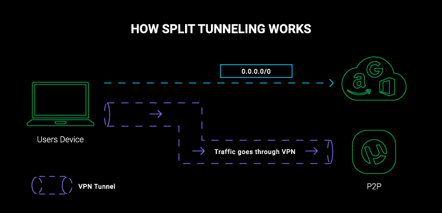
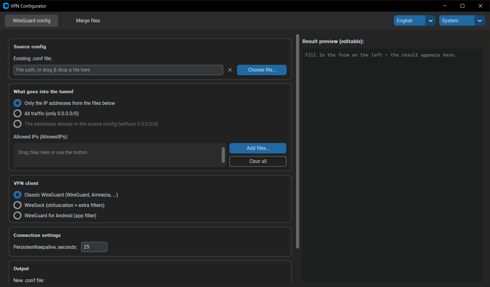

# VPN Configurator

> [🇷🇺 Russian version — README.md](README.md)

> [!IMPORTANT]
> This material is prepared for scientific and technical purposes. Using the provided materials for purposes other than familiarization may be a violation of applicable law.
> The author is not responsible for any improper use of this material!

**VPN Configurator** is a GUI tool for creating VPN client configurations with **split tunneling** and for merging IP address files. The interface language — Russian or English — is detected automatically and can be switched manually.

**Split tunneling** is a VPN mode where only traffic to specified websites or services goes through the VPN, while everything else continues to work at full speed without any slowdown.



> [!TIP]
> **This is the client side. The server side is [vpn-infra](https://github.com/Friskes/vpn-infra).**
> It deploys a personal VPN on a plain VPS with one command: WireGuard, VLESS + Reality,
> two DNS tunnels and RustDesk, each service its own switch. That is where the `.conf`
> comes from — the one this tool turns into a split-tunneling config.

---

## Features

**1. WireGuard config (Amnezia / WireSock / WireGuard)**
Based on an existing `.conf` file, creates a new config with IP addresses for split tunneling:

- only the specified IP addresses — taken from address files;
- or all traffic (`0.0.0.0/0`);
- or the addresses already present in the source config with the `0.0.0.0/0` dropped — handy when the issued config lists the needed subnets but ends with a catch-all tail and therefore pulls all traffic;
- **Classic WireGuard** (WireGuard, Amnezia and compatible clients) — a config with no non-standard keys;
- **WireSock** — adds obfuscation (masks WireGuard traffic from DPI) plus extra filters: excluding IP addresses from the tunnel (`DisallowedIPs`) and an app blacklist or whitelist (`DisallowedApps` / `AllowedApps`). Into the app list you can drop an executable of any OS (`.exe`, a macOS/Linux binary, `.app`) — the file name becomes the app name — or a text file listing app names;
- **WireGuard for Android** — an app blacklist or whitelist by Android package name (`ExcludedApplications` / `IncludedApplications`). These two keys are understood only by WireGuard for Android and its forks (AmneziaWG, WG Tunnel) — desktop clients reject such a config with an `Invalid key` error, which is why the mode is a separate option.

**Two VPNs side by side.** If a second tunnel runs in parallel (e.g. a corporate one), point the app at its `.conf` — its server address and its specific subnets get subtracted from the generated config's `AllowedIPs`. Without that, the second VPN's packets get wrapped inside the first tunnel (the double wrapping doesn't fit the MTU — websites work intermittently) and its subnets get hijacked. LAN exclusions and manual exclusion lists can be carved directly out of `AllowedIPs` — such a config is understood by any client, including Amnezia, which has no `DisallowedIPs` key.

In the **"tunnel all traffic"** mode the VPN server address from `Endpoint` is excluded from the tunnel automatically. The point: services hosted on that same server (a panel, your own RustDesk, a proxy) stay reachable directly instead of taking a hairpin through the tunnel. WireSock simply gets the address appended to `DisallowedIPs`; Android has no such key, so `0.0.0.0/0` is replaced with a list of ranges that leaves the server address out. A domain name in `Endpoint` is not resolved — the server address may change, and a one-off resolution baked into the config would become wrong.

For every client there is a **`PersistentKeepalive`** field (in seconds) — it keeps the NAT mapping alive so the server can reach the client back. The field is prefilled from the source config, and with the WireGuard-recommended `25` when the key is missing or set to `0`. You can change the value before generating, and an empty field leaves the key exactly as it was in the source.

**2. Merge / convert IP address files**
Merges multiple files into one, removing duplicates and invalid addresses. Input files — in any mix, the format is detected automatically, the extension does not matter:

- addresses in any text form — one per line, comma, space or semicolon separated;
- Windows `route ADD <ip> MASK <mask> <gateway>` commands;
- Amnezia `.json`.

Output format of your choice: plaintext `.txt`, Amnezia `.json`, or Windows `route` commands (`.bat`). One input file + a different output format = conversion.

In the GUI you can drag & drop files straight into the program window, remove them one by one with the button next to each, and the result is shown in an editable preview with syntax highlighting — you can tweak the text by hand before saving.



---

### Ready-to-use IP address sets in the `AllowedIPs/` folder

| File | Service |
|---|---|
| `youtube.txt` | YouTube |
| `chatgpt.txt` | ChatGPT / OpenAI |
| `discord.txt` | Discord |
| `ghcopilot.txt` | GitHub Copilot |
| `instagram.txt` | Instagram |
| `jetbrains.txt` | JetBrains |
| `telegram.txt` | Telegram |
| `whatsapp.txt` | WhatsApp |
| `pypi.txt` | PyPI / pip / uv / uvx (Python packages) |
| `twitch.txt` | Twitch (1080p + Unblock GeoIP) |
| `meta.txt` | Meta (Facebook / Instagram / WhatsApp) |
| `anthropic.txt` | Anthropic / Claude Code |
| `rutracker.txt` | RuTracker |
| `all.txt` | All services above merged into a single file |

More sets — in the [Where to get IP addresses](#where-to-get-ip-addresses) section.

### Ready-to-use app lists

| Folder | Purpose |
|---|---|
| `DisallowedApps/` | App names for the WireSock filter (`DisallowedApps` / `AllowedApps`) |
| `ExcludedApplications/` | Android package names for WireGuard for Android (`ExcludedApplications` / `IncludedApplications`) |

Each folder has an `all.txt` — the combined list; currently it contains RustDesk.

---

## How to Run

### Windows (.exe)

1. Download the `.exe` from the releases page: **[⬇ GitHub Releases](https://github.com/Friskes/vpn-configurator/releases/latest)**
2. **Double-click** it — the graphical interface will open.

### macOS

1. Download the archive for your CPU architecture from the releases page: **[⬇ GitHub Releases](https://github.com/Friskes/vpn-configurator/releases/latest)**

   | Processor | File |
   |---|---|
   | Apple M1/M2/M3/M4 | `vpn_configurator_vX.X.X.macos-arm64.zip` |
   | Intel | `vpn_configurator_vX.X.X.macos-x86_64.zip` |

   > Not sure which one you have? Click  → "About This Mac" — the "Chip" or "Processor" line will tell you.
2. Unpack the archive — it contains `vpn_configurator.app`. **Double-click** it (the graphical interface opens, no terminal window).

   > The app is unsigned, so on first launch macOS may block it. Remove the quarantine flag once from the **Terminal**:
   >
   > ```bash
   > xattr -dr com.apple.quarantine ~/Downloads/vpn_configurator.app
   > ```
   >
   > Or: right-click the `.app` → "Open" → "Open" in the dialog.

> The former interactive terminal (CLI) version of the program is available in older releases — up to [v0.2.3](https://github.com/Friskes/vpn-configurator/releases/tag/v0.2.3) inclusive.

### From source (Python 3.12+)

The project uses [uv](https://docs.astral.sh/uv/) to manage dependencies (install it via `pip install uv` or the [official guide](https://docs.astral.sh/uv/getting-started/installation/)).

```bash
uv sync              # creates .venv and installs dependencies from uv.lock
uv run python vpn_configurator.py
```

---

## Building the Binary Locally

```bash
uv run pyinstaller -w -F --collect-all customtkinter --collect-all tkinterdnd2 vpn_configurator.py
```

The `-w` flag builds without a console window: on Windows it's an `.exe`, on macOS a `dist/vpn_configurator.app` bundle (launches on double-click, no terminal).

---

## Importing the Configuration into an App

### Amnezia (Windows / Android)

1. Tap the `+` icon on the main screen of the app
2. Select **"The connection settings file"**
3. Choose the generated `.conf` file
4. If the app suggests enabling obfuscation — agree
5. Tap **"Connect"**

### WireGuard / WireSock (Windows)

Import the generated `.conf` file via the **"Add tunnel from file"** menu.

---

## Where to Get IP Addresses

Ready-to-use sets are already available in the [`AllowedIPs/`](https://github.com/Friskes/vpn-configurator/tree/main/AllowedIPs) folder. Additional resources:

- [Various IP address collections (gist)](https://gist.github.com/iamwildtuna/7772b7c84a11bf6e1385f23096a73a15)
- [IP addresses in Amnezia format (gist)](https://gist.github.com/iamwildtuna/ea245d39c60753db9150e5fb0da4a5b7)
- [IP address ranges website 1](https://rockblack.su/vpn/dopolnitelno/diapazon-ip-adresov)
- [IP address ranges website 2](https://rockblack.pro/vpn/dopolnitelno/diapazon-ip-adresov)
- [iplist.opencck.org](https://iplist.opencck.org)
- [iplist.opencck.org (beta)](https://beta.iplist.opencck.org/)
- [antifilter.download](https://antifilter.download/)
- [Discord IP addresses](https://github.com/GhostRooter0953/discord-voice-ips)
- [Global IP addresses (RockBlack-VPN)](https://github.com/RockBlack-VPN/ip-address/blob/main/Global)

---

## Useful Links

- [vpn-infra](https://github.com/Friskes/vpn-infra) — the server side of the same pair: a personal VPN server on a plain VPS with one command
- [Amnezia VPN](https://github.com/amnezia-vpn/amnezia-client) — VPN client with obfuscation support for Windows, macOS, Android, iOS
- [WireSock VPN Client](https://www.wiresock.net/) — WireGuard client for Windows with split tunneling support
- [WireGuard](https://github.com/WireGuard/wireguard-windows) — official WireGuard client for Windows

---

## License

The project is distributed under the [MIT](LICENSE) license.
